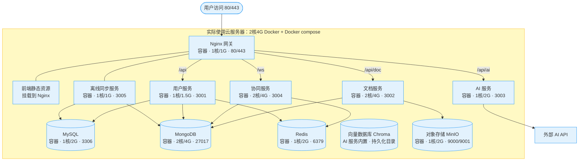
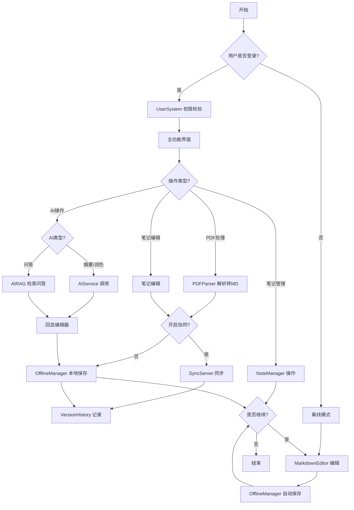
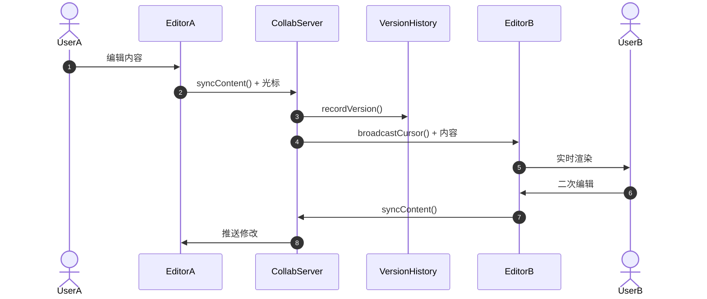
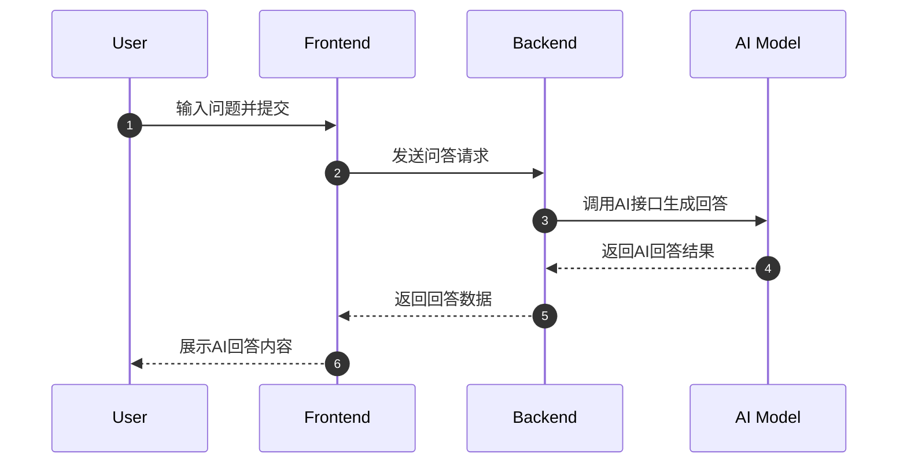

# 基于 AI 增强的协作式文档笔记系统开发任务书

## 一、背景介绍

在知识爆炸的时代,学生和科研人员面临“收藏从未停止,阅读从未开始” 的困境｡本项目旨在打造一个以 AI 为核心驱动的协作笔记平台,打破PDF 静态文件与动态笔记之间的隔阂,实现“输入(PDF)-处理(AI)-产出(Markdown 协作)”的闭环｡

通过我们的调研，市场上的主流竞品主要有：

|     产品      |             优势             |                    局限                     |
| :-----------: | :--------------------------: | :-----------------------------------------: |
|    Notion     |     编辑体验好，功能强大     | PDF 处理弱、付费 AI、依赖云端（数据易丢失） |
|   Obsidian    |     编辑体验好，本地优先     | AI 功能和 pdf 处理依赖复杂插件，学习成本高  |
| 各种 RAG 工具 |   AI 问答能力强，基于本地    |          编辑体验差，pdf 处理一般           |
|    Typora     | 极简编辑体验，本地纯文件存储 |             无 pdf 处理，无 AI              |

## 二、欲解决问题

1. **静态 PDF 的 “价值孤岛”**：传统 PDF 内容难以直接转化为结构化的 Markdown 笔记，存在 “提取难、重构慢” 的问题。
2. **协作冲突与延迟**：多人同时编辑文档时产生的版本冲突以及高延迟导致的协作体验极差。
3. **信息过载带来的阅读焦虑**：面对动辄数十页的专业文献，用户难以快速获取核心论点，缺乏高效的摘要与导读机制。

**我们的定位：** 具备 Notion 级别的协作体验，同时拥有 NotebookLM 级别的 PDF 深度理解能力，且支持 Markdown 原生驱动。

## 三、推荐方案

本项目提议开发一套基于“边端协同”架构的 AI 协作笔记系统，核心架构采用 **“前端托管+云端数据+本地算力/模型服务商”** 的异构部署方案。

### 3.1 协同编辑与富文本编辑器

|   组件   |                             说明                             |                 链接                 |
| :------: | :----------------------------------------------------------: | :----------------------------------: |
|   Yjs    | 高性能 CRDT 协同引擎，支持多人实时编辑、离线协作，与多种编辑器深度集成 |      https://github.com/yjs/yjs      |
|  TipTap  | 基于 ProseMirror 的无头富文本编辑器，原生支持 Yjs 协同，提供 Markdown 快捷键、表格、数学公式等扩展 | https://github.com/ueberdosis/tiptap |
|  Quill   | 经典富文本编辑器，可通过 quill-cursors 等插件实现协同，轻量兼容好 |   https://github.com/quilljs/quill   |
| Milkdown | 插件化 Markdown 编辑器，基于 ProseMirror，支持协同 (Yjs) 和数学公式 (KaTeX) | https://github.com/Milkdown/milkdown |
|  ByteMD  |   字节跳动开源 Markdown 编辑器，React 生态，支持插件化扩展   | https://github.com/bytedance/bytemd  |

建议组合：Yjs + TipTap（成熟、文档全、社区活跃）

### 3.2 PDF 智能解析

|  组件   |                             说明                             |                  链接                  |
| :-----: | :----------------------------------------------------------: | :------------------------------------: |
| MinerU  | 上海人工智能实验室开源，专为 PDF 转 Markdown 设计，保留标题、表格、公式等复杂结构 | https://github.com/opendatalab/MinerU  |
| Marker  | 快速准确的 PDF 转 Markdown 工具，支持多栏、表格、代码块，适合批量处理 | https://github.com/VikParuchuri/marker |
| PyMuPDF | 轻量级 PDF 解析库 (Python)，可提取文本、图片、元数据，适合二次开发 |   https://github.com/pymupdf/PyMuPDF   |
| PDF.js  |    Mozilla 开源 PDF 渲染器 (前端)，用于在线预览和文本提取    |   https://github.com/mozilla/pdf.js    |

建议：高质量层级还原优先选 MinerU 或 Marker，直接输出 Markdown，减少后处理。

### 3.3 RAG 与 AI 编排

|     组件     |                             说明                             |                      链接                       |
| :----------: | :----------------------------------------------------------: | :---------------------------------------------: |
|  LlamaIndex  | 专为 RAG 设计的框架，提供数据连接器、索引、检索、问答流水线，支持 PDF 加载 |    https://github.com/run-llama/llama_index     |
|  LangChain   | 通用大模型应用编排框架，可搭建摘要、问答、RAG 等流程，生态丰富 |    https://github.com/langchain-ai/langchain    |
|    Chroma    | 轻量级向量数据库，存储检索文档切片，与 LlamaIndex/LangChain 无缝集成 |      https://github.com/chroma-core/chroma      |
| Unstructured | 处理非结构化数据工具，从 PDF、HTML 等提取干净文本，配合 RAG 使用 | https://github.com/Unstructured-IO/unstructured |

建议：LlamaIndex + Chroma 快速搭建 RAG 原型，再按需优化。

## 四、环境要求

### 2 核 4G 服务器资源分配总表

|      服务组件       |     方案      |                    说明                    |
| :-----------------: | :-----------: | :----------------------------------------: |
|     Nginx 网关      | 0.2 核 / 128M |            仅路由转发，消耗极低            |
|    前端静态资源     |   （挂载）    |               由 Nginx 托管                |
|      用户服务       | 0.3 核 / 128M |             登录、鉴权逻辑轻量             |
|      文档服务       |  0.6 核 / 1G  |     核心服务，处理文档和 PDF，重点保障     |
|       AI 服务       | 0.4 核 / 512M | 仅调用外部 API，消耗在网络 I/O，内存需求低 |
|      协同服务       | 0.4 核 / 256M |             维护连接需分配内存             |
|    离线同步服务     | 0.2 核 / 128M |          后台低频任务，资源需求低          |
|        MySQL        | 0.3 核 / 256M |            需稳定，分配基础内存            |
|       MongoDB       | 0.5 核 / 768M |     存储文档和协同数据，第二重要数据库     |
|        Redis        | 0.2 核 / 64M  |          缓存服务，可限制最大内存          |
| 向量数据库 (Chroma) |  （AI 服务内置）  |       持久化目录挂载 volume，资源随 AI 服务分配       |
|  对象存储 (MinIO)   | 0.2 核 / 128M |          存储原始 PDF / 图片文件           |
|  Docker & 系统预留  |    约 0.5G    |          为系统和 Docker 引擎预留          |

### 部署组件与技术栈对应表

- Nginx：反向代理、静态文件服务器
- 前端：构建用户界面，API 交互 + WebSocket 连协同服务
- 用户服务：UserSystem（登录、权限）/MySQL，数据权限管理
- 文档服务：NoteManager、MarkdownEditor、PDFParser/MongoDB 驱动
- AI 服务：AIService、AIRAG/Python FastAPI，AI 问答与 RAG
- 协同服务：WebSocket，Redis 广播，MongoDB 存储
- 离线同步：OfflineManager/Node.js 或 Go
- 数据库：MySQL（用户数据）、MongoDB（文档、协同历史）、Redis（缓存）
- 对象存储：MinIO（兼容 S3，存 PDF、图片）
- AI 模型：本地Ollama / 模型提供商API

## 五、软件系统的功能描述

### 5.1 利益相关者功能

| 利益相关方 |                        软件功能和行为                        |
| :--------: | :----------------------------------------------------------: |
|  普通用户  | 1. 登录 / 注册   2. 创建 / 编辑 Markdown 笔记（离线、本地保存）  3. 上传解析 PDF   4.AI 总结 / 润色   5. 笔记库 AI 问答   6. 笔记管理（分类、搜索、删除） |
|   协作者   | 1. 加入共享文档   2. 实时查看他人编辑光标与内容   3. 多人同文档编辑   4. 查看 / 恢复版本历史 |
| 系统管理员 | 1. 管理用户   2. 监控系统状态   3. 配置 AI 服务参数（API Key 等） |

### 5.2 功能优先级明细

|        功能名        |                           简要描述                           |    优先级    | 重要性 | 工作量 |
| :------------------: | :----------------------------------------------------------: | :----------: | :----: | :----: |
|    Markdown 编辑     | 实时渲染块级编辑器，支持标题、代码块、表格、LaTeX，本地存储、离线编辑 | 第一次迭代前 |   高   |   高   |
| 笔记管理（本地优先） |        笔记增删移分类搜索，本地保存、导出，不依赖云端        | 第一次迭代前 |   高   |   中   |
|       用户管理       |          注册登录、信息管理，权限隔离，支持离线使用          | 第一次迭代前 | 中→高  |   中   |
|    PDF 解析与转换    |     上传 PDF，MinerU/Marker 提取结构，生成 Markdown 草稿     | 第二次迭代前 |   高   |   中   |
|     AI 智能摘要      |             文本 / 全文生成摘要、要点，流式输出              | 第二次迭代前 |   高   |   中   |
|  AI 智能问答（RAG）  |      笔记库 / 文档自然语言提问，PDF 检索回答，流式输出       | 第二次迭代前 |   高   |   高   |
|     多人实时协同     |         多人同文档编辑，毫秒同步、光标显示、版本回溯         | 第二次迭代前 |   高   |   高   |
|     AI 文本润色      |                   选中文本法修正、风格优化                   | 第三次迭代前 |   中   |   中   |
|       系统设置       |        管理员配置 AI API 密钥、PDF 解析参数，动态生效        | 第三次迭代前 |   低   |   低   |

## 六、可行性及潜在风险

### 为了确保能在学期末能交出作品，我们确定了最小可行性产品的核心功能：

- 基础编辑：支持 CommonMark 语法的实时协作编辑器
- 智能导入：PDF 拖拽上传，提取文本并按标题分段
- 一键摘要：选中段落 / 全文生成摘要
- 部署架构：Docker 微架构部署

| 风险类别 | 风险描述                                           | 对策                                                         |
| -------- | -------------------------------------------------- | ------------------------------------------------------------ |
| 技术风险 | 8 个人同时编辑时产生复杂的冲突，或数据同步死锁。   | 采用 Yjs 官方推荐的 ydoc 管理机制，并在测试阶段进行模拟高并发压力测试。 |
| 硬件风险 | 核心算力节点因散热或网络问题宕机。                 | 建立双线容灾：本地模型和低成本云端 API（如 DeepSeek）并行    |
| 进度风险 | 8 人协作沟通成本过高，导致模块对接时出现大量 Bug。 | 制定严格的 UML 规范和 API 文档，采用敏捷开发模式，坚持每周进行一次集成演练。 |

## 七、 承担人员

- 需求分析负责人（1 人）：

  特点：具备极强的逻辑思维和用户共情能力。

  要求：负责编写软件需求规格说明书，定义 Markdown 支持语法子集及 AI 摘要的触发逻辑。

  

- 设计负责人（2 人）：

  特点：审美敏锐，熟悉组件化设计思维。

  要求：负责使用 Figma 产出高保真原型，统一系统的 UI 规范，确保协作时的视觉反馈（如多用户光标）直观清晰。

  

- 代码负责人（2 人）：

  特点：架构掌控力强，具备全栈开发能力。

  要求：负责核心技术选型，设计系统 UML 图，解决后端并发逻辑中的瓶颈问题。

  

- 代码开发组员（3-5 人）：

  特点：编码执行力强，熟悉 TypeScript 或 Python 等。

  要求：分别负责前端编辑器扩展、后端数据库接口及 AI 提示词工程。

  

- 测试负责人（1 人）：

  特点：细致严谨，具备 “破坏者” 思维。

  要求：编写测试用例，负责自动化测试脚本编写，重点关注多人协作下的数据一致性校验。

  

- 部署负责人（1 人）：

  特点：熟悉 Linux 系统运维及网络安全。

  要求：负责 Docker 环境搭建、内网穿透配置、CI/CD 流线建设，以及监控服务器的运行状态。