# AI 增强的协作式笔记系统——软件设计规格说明书

更新日期：2026 年 5 月 30 日

---

# 1 引言

## 1.1 编写目的

本文档从体系结构、用户界面、用例、类与数据等多个层次，给出"AI 增强的协作式笔记系统"完整、可指导编码的设计方案，供评审人员对其正确性与合理性进行评审，并作为后续开发与测试的依据。文档的论述重心放在本系统的四大核心能力——**实时协作、离线优先、AI 检索增强问答与 PDF 智能解析**上；用户登录、分享、审计等通用支撑功能仅作必要说明。

## 1.2 读者对象

最终用户、软件设计人员、前端工程师、后端工程师、AI/算法工程师、运维工程师、软件需求分析人员、质量保证人员、软件测试工程师等。

## 1.3 软件项目概述

**项目名称：** AI 增强的协作式笔记系统

**用户单位：** 学生、研究人员、知识工作者及团队协作用户

**开发单位：** 本项目组

**软件项目的背景和大致功能：**

随着远程办公和移动学习的普及，使用者对于“随处可写、随处可读、随处协作”的笔记工具提出了更高的要求。传统的本地笔记应用难以满足多端同步、实时协作和智能化辅助的需求；而完全云端的笔记应用又在弱网或离线场景下表现糟糕，且大多缺乏对 PDF 文献、长文档智能问答等专业能力的支持。

本系统专为解决上述问题而设计。它以 Markdown 为核心内容载体，采用前后端分离的微服务架构，通过 Nginx 作为统一网关对外提供 Web 端访问，同时打包 Electron 桌面端，覆盖浏览器、PWA 与桌面三种使用场景。其区别于普通笔记应用的**四大核心能力（主打亮点）**为：

1. **实时协作**：基于 CRDT（Yjs）的多人同时编辑，无冲突合并、毫秒级同步、断线自愈；
2. **离线优先**：基于 IndexedDB 的本地读写与 `baseUpdatedAt` 冲突检测，弱网/无网下可用，联网后自动同步；
3. **AI 检索增强问答（RAG）**：基于 LlamaIndex + Chroma 对当前文档建立向量索引，结合大模型以 SSE 流式作答；
4. **PDF 智能解析入库**：基于 MinerU 对 PDF 文献做图文结构化抽取，自动转笔记并建立检索索引。

这四项能力是本设计文档着力精化的对象；用户登录、分享、审计等为各类系统通用的支撑功能，本文从简。

## 1.4 文档概述

1）软件的设计约束部分。包括软件设计目标和原则、软件设计受到的约束和限制。

2）软件的设计部分。主要分为软件体系结构设计、用户界面设计、用例设计、类设计、数据设计以及部署设计。

## 1.5 定义

| 术语 | 说明 |
|------|------|
| CRDT | Conflict-free Replicated Data Type，无冲突复制数据类型，Yjs 是其在 Web 端的代表性实现 |
| ESM | ECMAScript Modules，Node.js 的现代模块化规范 |
| IndexedDB | 浏览器端的结构化对象数据库，本系统作为前端的离线数据缓存 |
| JWT | JSON Web Token，本系统跨服务身份认证的统一令牌格式 |
| MinIO | 兼容 S3 的对象存储服务，本系统用于保存 PDF 原文件与抽取出的图片 |
| MinerU | 高质量 PDF 解析引擎，可选启用以提升 PDF 结构化抽取效果 |
| PWA | Progressive Web App，本系统通过 Service Worker 提供离线 Web 体验 |
| RAG | Retrieval-Augmented Generation，检索增强生成，AI 服务的核心问答范式 |
| SSE | Server-Sent Events，AI 服务用于流式返回模型输出的协议 |
| Yjs | CRDT 框架，本系统协同编辑的核心数据结构 |

## 1.6 参考资料

[1] 《基于AI增强的协作式文档笔记系统开发任务书》

[2] 《基于AI增强的协作式文档笔记系统软件需求规格说明书》

[3] Yjs 官方文档. https://docs.yjs.dev

[4] TipTap官方文档：https://tiptap.dev

[5] LlamaIndex官方文档：https://docs.llamaindex.ai

---

# 2 软件设计约束

## 2.1 软件设计目标和原则

软件设计的目标是，根据软件系统的需求，综合考虑软件开发过程中的各种制约因素，遵循软件工程的设计原则，给出软件系统的实现解决方案和蓝图，产生可指导编码实现的设计模型及文档。

本设计在遵循软件工程通用原则（抽象与逐步求精、模块化与高内聚低耦合、信息隐藏、关注点分离、软件重用、迭代设计、可追踪性）的基础上，重点贯彻以下两条与本系统强相关的原则：

1. **离线优先原则**：客户端在弱网/无网环境下仍可正常使用基本功能（读写、编辑），本地以 IndexedDB 持久化，恢复联网后通过冲突检测自动同步，避免数据丢失或覆盖。
2. **服务自治原则**：每个微服务拥有独立的数据存储与独立的部署单元，可按各自负载独立扩缩容（如协作服务可水平扩展、AI 服务可独立分配 GPU），服务间仅通过明确定义的 HTTP/WebSocket 接口与统一令牌交互。

## 2.2 软件设计的约束和限制

**运行环境要求：** 服务端基于 Docker（Linux x86_64），Web 端兼容现代浏览器（Chrome、Firefox、Safari、Edge），桌面端基于 Electron，AI 服务在启用 MinerU 模式时需要 NVIDIA GPU。

**开发语言：** TypeScript（前端 + 4 个 Node 微服务）、Python 3.11（AI 服务）、SQL（MySQL DDL）、JavaScript（MongoDB 初始化脚本与 Electron 主进程 CJS 部分）。

**标准规范：**

- 所有 Node.js 微服务使用 ESM 模块规范（`"type": "module"`）；
- 前端测试统一使用 Vitest，后端 Node 服务统一使用 Jest + Supertest，AI 服务使用 pytest，端到端测试统一使用 Playwright；
- 服务间认证使用统一的 `JWT_SECRET`，内部调用附加 `INTERNAL_SERVICE_SECRET` 请求头；
- 前端 HTTP 请求统一通过 `apps/web/src/lib/api.ts` 进行封装；
- SSE 流式响应统一使用 `meta`、`chunk`、`done` 三种事件类型。

**开发工具：** VS Code、Docker Desktop、Node.js 20、Figma、npm workspaces、tsx、Vite、Playwright、Conda（管理 AI 服务的 Python 环境）。

---

# 3 软件设计

## 3.1 软件体系结构设计

整个系统采用前后端分离的微服务架构，由"前端 Web/桌面端"、"API 网关"、"业务微服务集群"、"基础数据服务"四个层次构成。前端通过 Nginx 网关访问后端，网关根据 URL 前缀将请求分发到不同的微服务；微服务之间通过 HTTP/WebSocket 进行内部通讯。整体体系结构如图 3-1 所示。

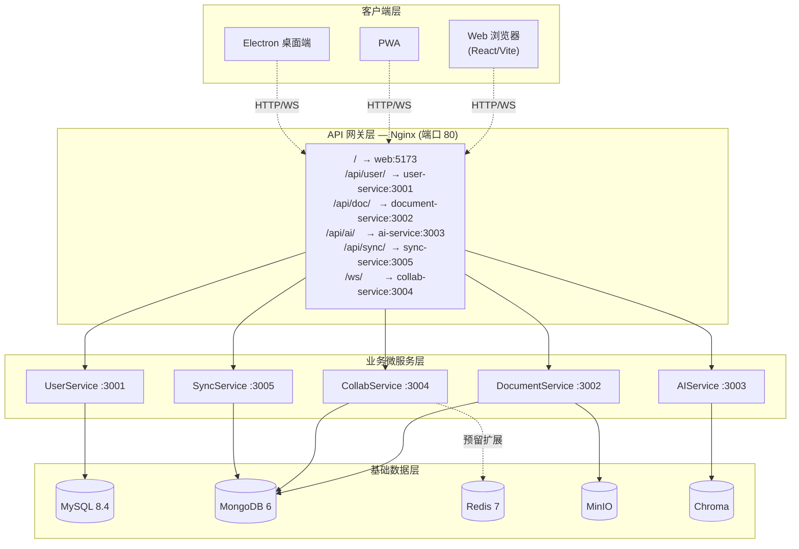
```mermaid
graph TB
    subgraph Client["客户端层"]
        Web["Web 浏览器<br/>(React/Vite)"]
        PWA["PWA"]
        Electron["Electron 桌面端"]
    end

    subgraph Gateway["API 网关层 — Nginx (端口 80)"]
        Nginx["/  → web:5173<br/>/api/user/  → user-service:3001<br/>/api/doc/   → document-service:3002<br/>/api/ai/    → ai-service:3003<br/>/api/sync/  → sync-service:3005<br/>/ws/        → collab-service:3004"]
    end

    subgraph Services["业务微服务层"]
        UserSvc["UserService :3001"]
        DocSvc["DocumentService :3002"]
        CollabSvc["CollabService :3004"]
        SyncSvc["SyncService :3005"]
        AISvc["AIService :3003"]
    end

    subgraph Data["基础数据层"]
        MySQL[("MySQL 8.4")]
        Mongo[("MongoDB 6")]
        Redis[("Redis 7")]
        MinIO[("MinIO")]
        Chroma[("Chroma")]
    end

    Web -.HTTP/WS.-> Nginx
    PWA -.HTTP/WS.-> Nginx
    Electron -.HTTP/WS.-> Nginx

    Nginx --> UserSvc
    Nginx --> DocSvc
    Nginx --> CollabSvc
    Nginx --> SyncSvc
    Nginx --> AISvc

    UserSvc --> MySQL
    DocSvc --> Mongo
    DocSvc --> MinIO
    CollabSvc --> Mongo
    CollabSvc -. 预留扩展 .-> Redis
    SyncSvc --> Mongo
    AISvc --> Chroma
```

<p align="center">图 3-1 AI 增强协作笔记系统的体系结构图</p>

该软件系统大致可以分为以下几个子系统：

**（1）Web 客户端（@notes/web）子系统**

它运行在浏览器或 Electron 容器中，职责包括：渲染笔记编辑器（基于 TipTap）、维护本地 IndexedDB 缓存、通过 Yjs 与协作服务建立 WebSocket 会话、调用各个后端 API、提供版本历史与分享对话框、提供 PWA 离线能力。它依赖于 API 网关与协作服务。

**（2）用户服务（user-service）子系统**

端口 3001。职责是负责用户的注册、登录、Google OAuth、邮箱验证码、JWT 签发与校验、共享关系（shares）管理、角色权限、审计日志的写入。它依赖 MySQL 数据库。

**（3）文档服务（document-service）子系统**

端口 3002。职责是负责笔记的 CRUD、版本快照、PDF 文件上传与 PDF 解析作业管理。它将 PDF 原文件与提取的图片保存到 MinIO，将文档 HTML 与版本元数据保存到 MongoDB，并通过 HTTP 调用 AI 服务完成解析。

**（4）协作服务（collab-service）子系统**

端口 3004。基于 `ws` 库的 WebSocket 服务。职责是中转 Yjs 文档的 update 与 awareness 消息，维护每篇文档当前的 CRDT 状态，并按以下两种触发条件向 MongoDB 落盘：

- 持续协作每 5 分钟生成一次自动快照；
- 最后一名协作者断开连接时立即落盘。

它依赖 MongoDB 持久化 update；awareness 在当前单实例部署下通过内存广播分发。docker-compose 已为其注入 `REDIS_URL` 并预留 `redis` 容器，用于后续多实例水平扩展时的跨实例广播，当前实现尚未接入。

**（5）同步服务（sync-service）子系统**

端口 3005。职责是接收 Web 端离线队列中的 push/pull 请求，基于 `baseUpdatedAt` 时间戳进行冲突检测，将客户端本地修改合并到 MongoDB 中。它仅处理笔记元数据级别的同步，CRDT 级别的合并仍由 collab-service 负责。

**（6）AI 服务（ai-service）子系统**

端口 3003。基于 Python FastAPI。职责是：PDF 解析（MinerU）、基于 LlamaIndex + Chroma 的检索增强问答、对多家大模型供应商的统一封装、通过 SSE 流式返回模型输出。

图 3-2 描述了 Web 客户端的设计架构，分为界面层、业务逻辑层和基础服务层。界面层与业务逻辑层的设计类来自需求用例模型与用例交互模型；基础服务层中的 `api.ts` 封装 HTTP 与 SSE，`offlineDb.ts` 封装 IndexedDB，`y-websocket` 是用于支持 CRDT 协作的开源软件。

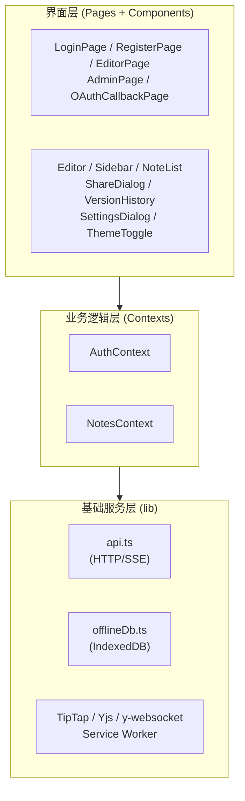
```mermaid
graph TB
    subgraph UI["界面层 (Pages + Components)"]
        Pages["LoginPage / RegisterPage / EditorPage<br/>AdminPage / OAuthCallbackPage"]
        Components["Editor / Sidebar / NoteList<br/>ShareDialog / VersionHistory<br/>SettingsDialog / ThemeToggle"]
    end

    subgraph Logic["业务逻辑层 (Contexts)"]
        AuthCtx["AuthContext"]
        NotesCtx["NotesContext"]
    end

    subgraph Base["基础服务层 (lib)"]
        Api["api.ts<br/>(HTTP/SSE)"]
        Offline["offlineDb.ts<br/>(IndexedDB)"]
        Third["TipTap / Yjs / y-websocket<br/>Service Worker"]
    end

    UI --> Logic
    Logic --> Base
```

<p align="center">图 3-2 "Web 客户端（@notes/web）"子系统的设计架构</p>

图 3-3 描述了"AI 服务"子系统的设计架构。设计类主要来自需求用例模型与用例交互模型。`PDFParser` 通过 `MinerUAdapter` 调用本地 `mineru` 命令或独立的 MinerU API；`RAGEngine` 内部封装了 `LlamaIndexLoader` 与 `ChromaStore`；`ModelGateway` 屏蔽了不同 LLM 供应商的差异，统一对外暴露 `call_model()` 与 `stream_model()` 接口。

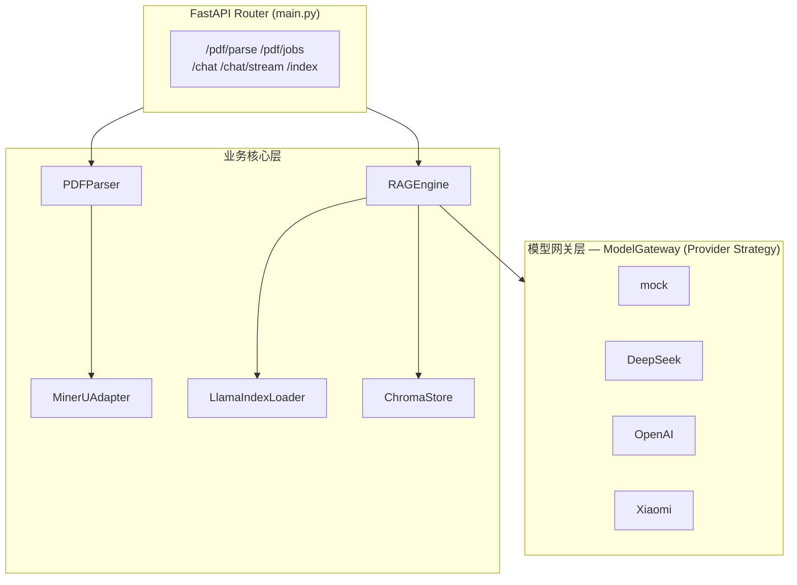
```mermaid
graph TB
    subgraph Router["FastAPI Router (main.py)"]
        R["/pdf/parse  /pdf/jobs<br/>/chat  /chat/stream  /index"]
    end

    subgraph Core["业务核心层"]
        PDF["PDFParser"]
        RAG["RAGEngine"]
        Miner["MinerUAdapter"]
        Llama["LlamaIndexLoader"]
        ChromaS["ChromaStore"]
        PDF --> Miner
        RAG --> Llama
        RAG --> ChromaS
    end

    subgraph Gateway["模型网关层 — ModelGateway (Provider Strategy)"]
        Mock["mock"]
        DS["DeepSeek"]
        OAI["OpenAI"]
        XM["Xiaomi"]
    end

    Router --> PDF
    Router --> RAG
    RAG --> Gateway
```

<p align="center">图 3-3 "AI 服务（ai-service）"子系统的设计架构</p>

图 3-4 描述了"文档服务（document-service）"子系统的设计架构。该子系统是后端中职责最重的子系统，其路由层按业务划分为四组：笔记 CRUD、版本快照与回滚、PDF 解析（同步 `/pdf/upload` 与异步 `/pdf/jobs` 双管线）、图片上传与读取；并对外提供 `/internal/check-ownership` 内部接口供 collab-service 校验文档归属。控制层中 `auditLog` 与 `checkShareAccess` 是横切关注点，分别负责写审计记录与共享权限判定，`processPdfJob` 负责异步 PDF 作业的状态流转。仓储层依据 §3.5.2 的设计划分为 `DocumentRepository`、`VersionRepository`、`UpdateRepository` 与 `PdfJobRepository`，分别对应 MongoDB 中的 `documents`、`versions`、`document_updates`、`pdf_parse_jobs`/`pdf_assets` 集合；`MinioStorage` 封装 MinIO 对象读写。该子系统在运行时还会外调 ai-service（PDF 解析与建索引）与 user-service（共享关系与权限校验）。

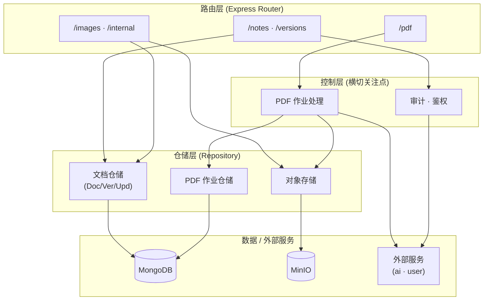
```mermaid
graph TB
    subgraph Router["路由层 (Express Router)"]
        RDoc["/notes · /versions"]
        RPdf["/pdf"]
        RMisc["/images · /internal"]
    end

    subgraph Control["控制层 (横切关注点)"]
        Ctl["审计 · 鉴权"]
        PdfProc["PDF 作业处理"]
    end

    subgraph Repo["仓储层 (Repository)"]
        DocStore["文档仓储<br/>(Doc/Ver/Upd)"]
        JobStore["PDF 作业仓储"]
        ObjStore["对象存储"]
    end

    subgraph Data["数据 / 外部服务"]
        Mongo[("MongoDB")]
        MinIO[("MinIO")]
        Ext["外部服务<br/>(ai · user)"]
    end

    RDoc --> Ctl
    RDoc --> DocStore
    RPdf --> PdfProc
    RMisc --> DocStore
    RMisc --> ObjStore

    PdfProc --> JobStore
    PdfProc --> ObjStore
    PdfProc --> Ext
    Ctl --> Ext

    DocStore --> Mongo
    JobStore --> Mongo
    ObjStore --> MinIO
```

<p align="center">图 3-4 "文档服务（document-service）"子系统的设计架构</p>

 其余两个 Node 子系统结构较为简单，不再单独绘制架构图：**user-service** 为"路由层 → `AuthService`/`ShareService` 控制层 → `UserRepository`（MySQL）"的标准三层结构，其登录路径的类设计另见图 3-21；**sync-service** 仅含一个 `/sync` 路由与基于 `baseUpdatedAt` 的冲突检测逻辑，直接读写 MongoDB。**collab-service** 的内部结构以类图形式在 §3.4.3（图 3-20）中给出。

## 3.2 用户界面设计

根据本系统的用例描述与每个用例的交互图，可以发现该软件系统在 Web 端需要有以下一组界面以支持用户的操作：

- **登录界面 LoginPage**：其职责是帮助用户输入邮箱与密码以登录到系统之中，同时提供 Google OAuth 入口与"忘记密码"链接。
- **注册界面 RegisterPage**：其职责是引导用户完成邮箱验证码注册流程。
- **OAuth 回调页 OAuthCallbackPage**：其职责是接收 Google 授权码并完成 JWT 换取。
- **编辑器主界面 EditorPage**：其职责是显示当前选中笔记的内容并支持实时编辑与协作；它由侧边栏、笔记列表与编辑器三部分组成。
- **管理后台界面 AdminPage**：其职责是帮助管理员查看用户、调整角色、查看审计日志。
- **分享对话框 ShareDialog**：其职责是帮助用户管理某篇笔记的协作者及其读写权限。
- **版本历史对话框 VersionHistory**：其职责是展示笔记的历史版本并提供回滚操作。
- **设置对话框 SettingsDialog**：其职责是配置 AI 供应商、PDF 解析模式、主题等参数。

图 3-5 描述了"AI 增强协作笔记系统"用户界面跳转关系图。


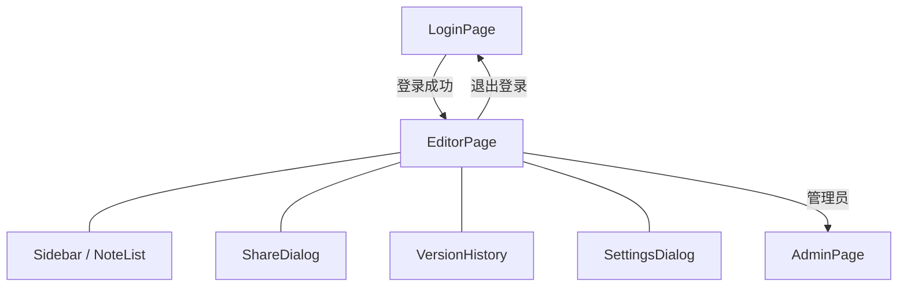
```mermaid
graph TB
    Login["LoginPage"]
    Editor["EditorPage"]
    Sidebar["Sidebar / NoteList"]
    Share["ShareDialog"]
    Version["VersionHistory"]
    Settings["SettingsDialog"]
    Admin["AdminPage"]

    Login -->|登录成功| Editor
    Editor -->|退出登录| Login
    Editor --- Sidebar
    Editor --- Share
    Editor --- Version
    Editor --- Settings
    Editor -->|管理员| Admin
```

<p align="center">图 3-5 "AI 增强协作笔记系统"用户界面跳转关系图</p>

### 3.2.1 登录界面 LoginPage

本界面为用户登录的界面，用户输入注册时使用的邮箱并输入设定的密码即可登录；如果忘记密码，可以通过"忘记密码"链接通过邮箱验证码重置；也可以通过 Google OAuth 一键登录。


<p align="center">图 3-6 "AI 增强协作笔记系统"登录界面</p>

### 3.2.2 编辑器主界面 EditorPage

本界面为用户进入系统后的主界面，由左侧的"侧边栏 + 笔记列表"和右侧的"编辑器"两部分构成。侧边栏支持文件夹导航、新建笔记、搜索；编辑器支持 Markdown 富文本编辑、AI 问答（右侧抽屉式面板）、协作者头像列表、分享按钮、版本历史按钮等。


<p align="center">图 3-7 "AI 增强协作笔记系统"编辑器主界面</p>

### 3.2.3 分享对话框 ShareDialog


<p align="center">图 3-8 "AI 增强协作笔记系统"分享对话框</p>

### 3.2.4 版本历史对话框 VersionHistory


<p align="center">图 3-9 "AI 增强协作笔记系统"版本历史对话框</p>

## 3.3 用例设计

本节给出各用例的实现设计。其中**「实时协作编辑」「离线编辑与同步」「AI 流式问答」「PDF 解析与入库」为本系统的核心用例**，是设计与精化的重点（§3.4 类设计亦围绕其展开）；「用户登录」「笔记分享与权限」「版本快照与回滚」「管理员审计」为支撑性通用用例，仅给出实现概要。下文先以"用户登录"为例说明一个标准三层用例的实现形态，随后展开各核心用例。

### 3.3.1 "用户登录"用例实现的设计方案

"用户登录"功能的实现主要是通过 `UserRepository` 对象提供的服务，查询 MySQL 数据库中是否有用户输入的邮箱和密码哈希信息，从而判断该用户的身份是否合法。验证通过后，由 `AuthService` 签发 JWT 并返回给前端。具体实现过程见图 3-10。

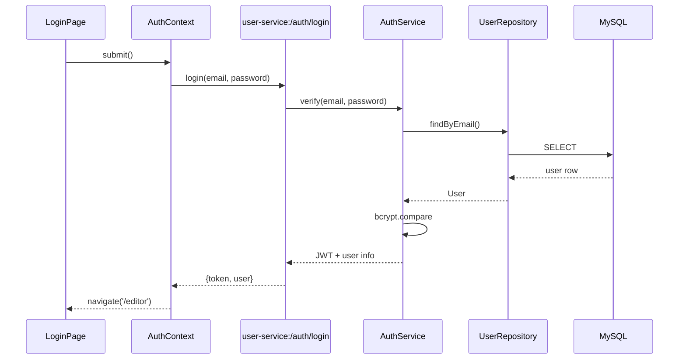
```mermaid
sequenceDiagram
    participant LP as LoginPage
    participant AC as AuthContext
    participant US as user-service:/auth/login
    participant AS as AuthService
    participant UR as UserRepository
    participant DB as MySQL

    LP->>AC: submit()
    AC->>US: login(email, password)
    US->>AS: verify(email, password)
    AS->>UR: findByEmail()
    UR->>DB: SELECT
    DB-->>UR: user row
    UR-->>AS: User
    AS->>AS: bcrypt.compare
    AS-->>US: JWT + user info
    US-->>AC: {token, user}
    AC-->>LP: navigate('/editor')
```

<p align="center">图 3-10 "用户登录"用例实现的顺序图</p>

如图 3-10 所示，`AuthService` 经 `UserRepository.findByEmail()` 读取 MySQL 用户记录并用 `bcryptjs` 校验密码哈希，通过后签发携带 `userId`、`role` 的 JWT 返回前端，前端持久化令牌并跳转 `/editor`；连续失败达阈值时通过 `failed_login_attempts`/`locked_until` 字段实现账户锁定。这是一个典型的"界面 → 控制 → 仓储 → 数据库"三层用例，注册、分享、审计等支撑用例与其形态一致，不再逐一展开。

### 3.3.2 "实时协作编辑"用例实现的设计方案

"实时协作编辑"用例的实现主要通过 Yjs CRDT 与 WebSocket 完成。前端为每篇笔记创建一个 `Y.Doc` 实例，借助 `y-websocket` 客户端与 `collab-service` 建立连接；服务端在内存中维护对应文档的 `Y.Doc`，对所有连接的客户端广播 update 和 awareness 消息，并定时将 update 持久化到 MongoDB 的 `document_updates` 集合，具体实现过程见图 3-11。

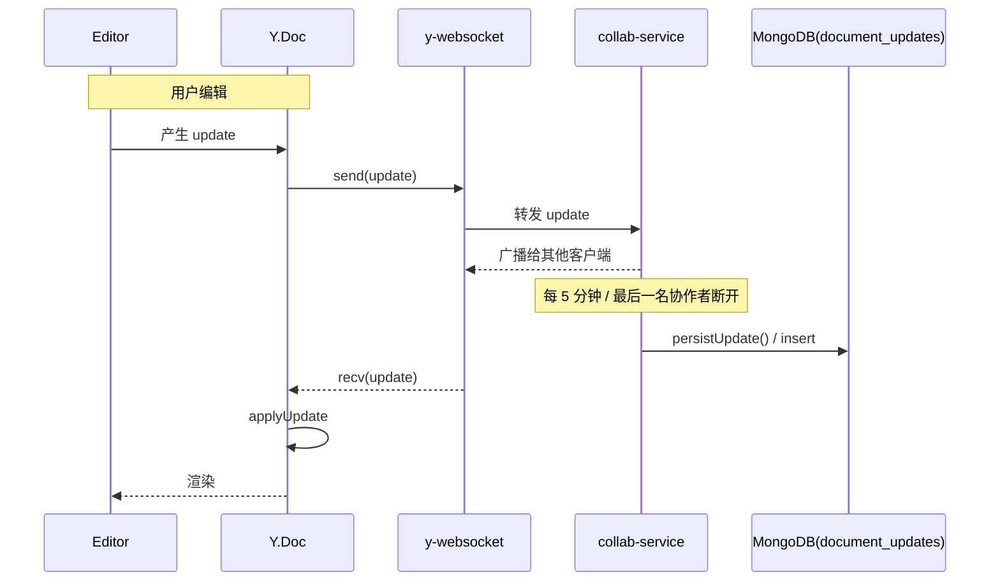
```mermaid
sequenceDiagram
    participant E as Editor
    participant Y as Y.Doc
    participant WS as y-websocket
    participant CS as collab-service
    participant DB as MongoDB(document_updates)

    Note over E,Y: 用户编辑
    E->>Y: 产生 update
    Y->>WS: send(update)
    WS->>CS: 转发 update
    CS-->>WS: 广播给其他客户端
    Note over CS: 每 5 分钟 / 最后一名协作者断开
    CS->>DB: persistUpdate() / insert
    WS-->>Y: recv(update)
    Y->>Y: applyUpdate
    Y-->>E: 渲染
```

<p align="center">图 3-11 "实时协作编辑"用例实现的顺序图</p>

客户端 `Editor` 组件挂载时创建 `Y.Doc` 与 `WebsocketProvider`（连接 URL 为 `/ws/{documentId}`）。`collab-service` 在 `connection` 事件中根据 URL 路径提取 `documentId`，从 MongoDB 中加载历史 update 重建 `Y.Doc`。每当任一客户端产生新的 update，服务端将其追加到内存 `Y.Doc` 并广播；同时使用计时器每 5 分钟（或当最后一名协作者断开时）将合并后的 update 持久化。`document.content` 字段（HTML 版本）由文档服务在版本快照时根据 CRDT 状态导出，用于离线访问。

### 3.3.3 "离线编辑与同步"用例实现的设计方案

"离线编辑与同步"用例的实现途径描述如下：客户端在创建/更新笔记时同步写入 IndexedDB 与 `sync_queue` 队列；当网络可用时，`NotesContext` 调用 `sync-service` 的 `push`/`pull` 接口将本地变更上传，并根据 `baseUpdatedAt` 进行冲突检测。具体实现过程见图 3-12。

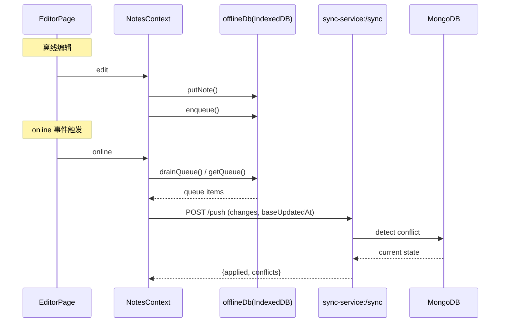
```mermaid
sequenceDiagram
    participant EP as EditorPage
    participant NC as NotesContext
    participant DB as offlineDb(IndexedDB)
    participant SS as sync-service:/sync
    participant Mongo as MongoDB

    Note over EP: 离线编辑
    EP->>NC: edit
    NC->>DB: putNote()
    NC->>DB: enqueue()
    Note over EP: online 事件触发
    EP->>NC: online
    NC->>DB: drainQueue() / getQueue()
    DB-->>NC: queue items
    NC->>SS: POST /push (changes, baseUpdatedAt)
    SS->>Mongo: detect conflict
    Mongo-->>SS: current state
    SS-->>NC: {applied, conflicts}
```

<p align="center">图 3-12 "离线编辑与同步"用例实现的顺序图</p>

客户端通过 `BroadcastChannel` 与 `navigator.locks` 协调多标签页，确保同一时刻只有一个标签页执行 `drainQueue`。冲突检测策略：若服务端文档的 `updatedAt` 大于客户端 `baseUpdatedAt`，则将该条变更标记为冲突，返回给客户端供用户决策（覆盖 / 放弃 / 合并）。

### 3.3.4 "AI 流式问答"用例实现的设计方案

"AI 流式问答"用例的实现途径描述如下：智能编辑器侧栏向 `ai-service` 的 `/chat/stream` 接口发起 SSE 请求，由 `RAGEngine` 在 Chroma 中检索与当前笔记关联的 chunk 作为上下文，再通过 `ModelGateway` 调用具体的 LLM 供应商完成流式生成，具体实现过程见图 3-13。

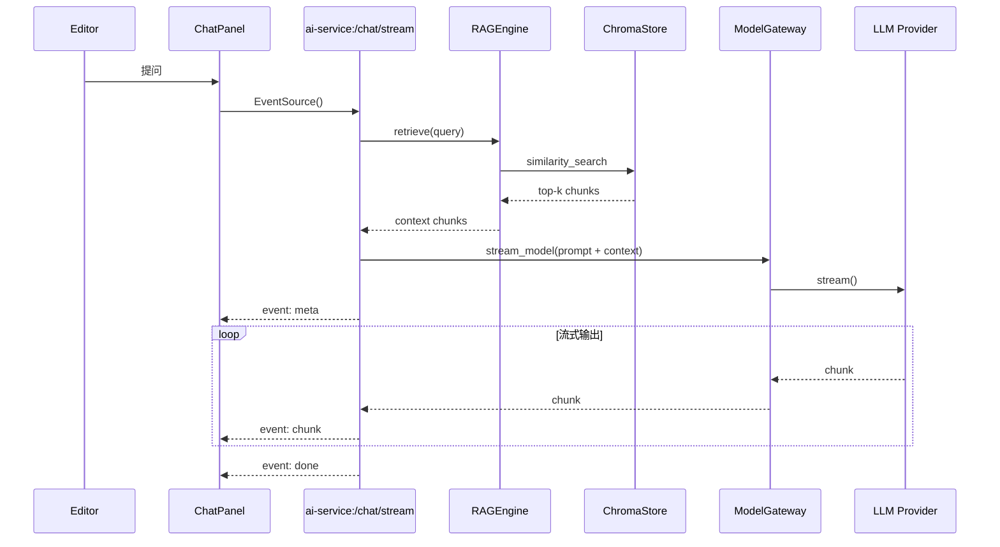
```mermaid
sequenceDiagram
    participant E as Editor
    participant CP as ChatPanel
    participant AI as ai-service:/chat/stream
    participant RAG as RAGEngine
    participant CS as ChromaStore
    participant MG as ModelGateway
    participant LLM as LLM Provider

    E->>CP: 提问
    CP->>AI: EventSource()
    AI->>RAG: retrieve(query)
    RAG->>CS: similarity_search
    CS-->>RAG: top-k chunks
    RAG-->>AI: context chunks
    AI->>MG: stream_model(prompt + context)
    MG->>LLM: stream()
    AI-->>CP: event: meta
    loop 流式输出
        LLM-->>MG: chunk
        MG-->>AI: chunk
        AI-->>CP: event: chunk
    end
    AI-->>CP: event: done
```

<p align="center">图 3-13 "AI 流式问答"用例的顺序图</p>

### 3.3.5 "PDF 解析与入库"用例实现的设计方案

"PDF 解析与入库"用例的实现途径分为同步与异步两种模式：

- 同步模式：`POST /pdf/upload`，文件较小、解析较快时直接同步返回；
- 异步模式：`POST /pdf/jobs`，文件较大或使用 MinerU 时进入作业队列，前端轮询 `GET /pdf/jobs/:id`。

具体实现过程见图 3-14。

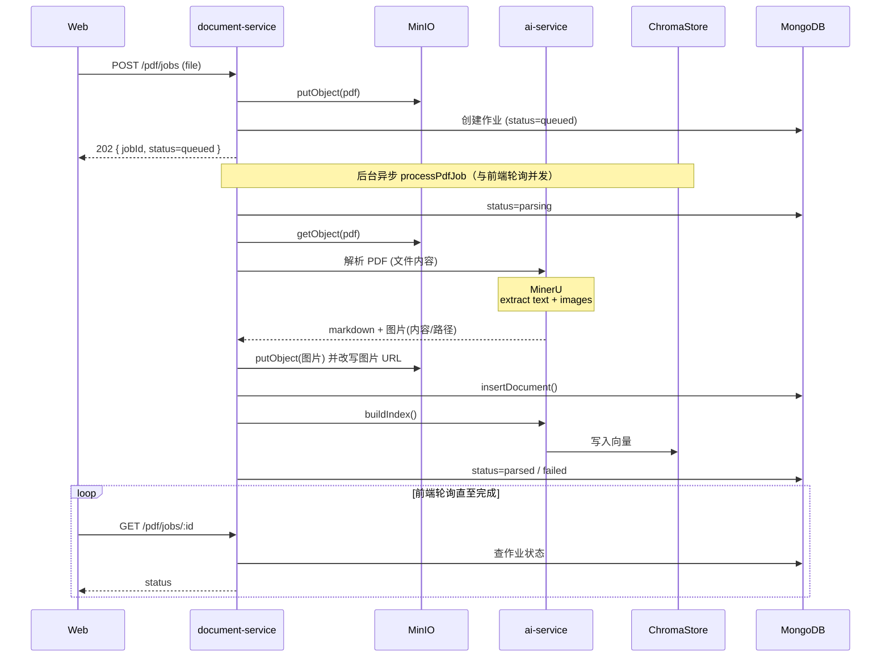
```mermaid
sequenceDiagram
    participant Web
    participant DS as document-service
    participant Min as MinIO
    participant AI as ai-service
    participant Chr as ChromaStore
    participant Mongo as MongoDB

    Web->>DS: POST /pdf/jobs (file)
    DS->>Min: putObject(pdf)
    DS->>Mongo: 创建作业 (status=queued)
    DS-->>Web: 202 { jobId, status=queued }

    Note over DS,Chr: 后台异步 processPdfJob（与前端轮询并发）
    DS->>Mongo: status=parsing
    DS->>Min: getObject(pdf)
    DS->>AI: 解析 PDF (文件内容)
    Note over AI: MinerU<br/>extract text + images
    AI-->>DS: markdown + 图片(内容/路径)
    DS->>Min: putObject(图片) 并改写图片 URL
    DS->>Mongo: insertDocument()
    DS->>AI: buildIndex()
    AI->>Chr: 写入向量
    DS->>Mongo: status=parsed / failed

    loop 前端轮询直至完成
        Web->>DS: GET /pdf/jobs/:id
        DS->>Mongo: 查作业状态
        DS-->>Web: status
    end
```

<p align="center">图 3-14 "PDF 解析与入库"用例实现的顺序图</p>

对于失败的作业，前端可以发起 `POST /pdf/jobs/:id/retry` 重试。`document-service` 将 PDF 解析过程中提取出来的图片重新上传到 MinIO 并改写 Markdown 中的图片 URL，然后保存为新笔记，并请求 `ai-service` 构建 Chroma 索引。

### 3.3.6 "笔记分享与权限"用例实现的设计方案

"笔记分享与权限"用例由 `user-service` 中的 `shares` 表统一管理。具体实现过程见图 3-15。

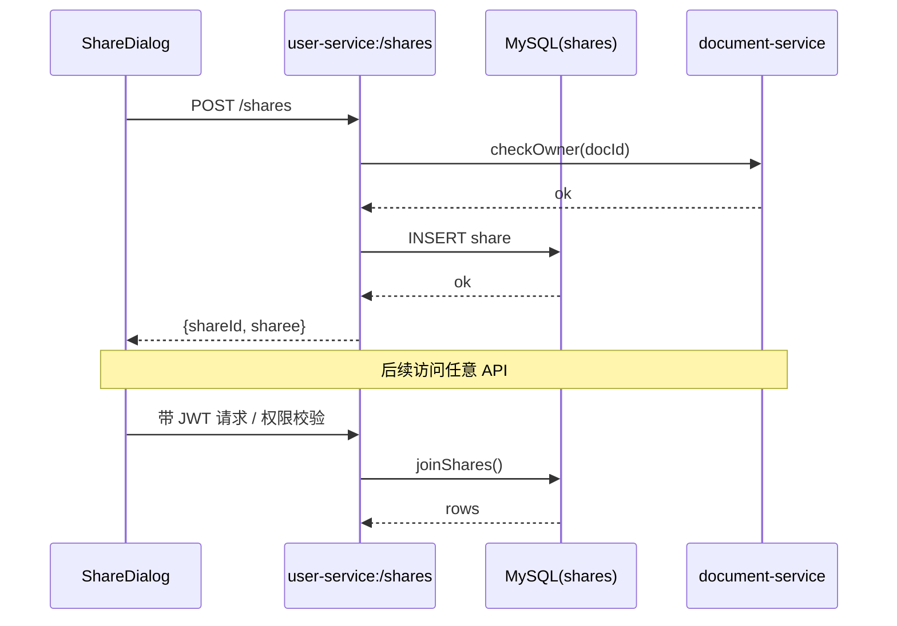
```mermaid
sequenceDiagram
    participant SD as ShareDialog
    participant US as user-service:/shares
    participant DB as MySQL(shares)
    participant DocS as document-service

    SD->>US: POST /shares
    US->>DocS: checkOwner(docId)
    DocS-->>US: ok
    US->>DB: INSERT share
    DB-->>US: ok
    US-->>SD: {shareId, sharee}

    Note over SD,DocS: 后续访问任意 API
    SD->>US: 带 JWT 请求 / 权限校验
    US->>DB: joinShares()
    DB-->>US: rows
```

<p align="center">图 3-15 "笔记分享与权限"用例实现的顺序图</p>

所有需要鉴权的微服务均通过 `Authorization: Bearer <JWT>` 解析出 `userId`，并对涉及文档的请求附加权限过滤逻辑：当前用户必须为文档 owner 或在 `shares` 表中存在对应记录，且 `permission` 满足要求（写操作需要 `write`）。

### 3.3.7 "版本快照与回滚"用例实现的设计方案

"版本快照与回滚"用例由 `document-service` 与 `collab-service` 分工实现（快照写入由两者分别触发，回滚仅由 document-service 完成）：

- 手动快照：用户点击"保存版本"，由 `document-service` 将当前 HTML 写入 `versions` 集合，保留最近 50 个版本；
- 自动快照：协作过程中由 `collab-service` 每 5 分钟触发一次，最后一名协作者断开时再触发一次；
- 回滚：用户在 `VersionHistory` 中选择某版本回滚时，由 `document-service` 单独完成——首先将当前内容存为一条"恢复前自动快照"，再把目标版本的 `yjsUpdate` 写回 `document_updates` 集合（若目标版本无 CRDT 数据则清空该 update 并改写 `documents.content`），最后更新 `documents`；下一次有协作者连接时，collab-service 会从 `document_updates` 重新加载该状态，无需 document-service 主动通知。

具体实现过程见图 3-16。

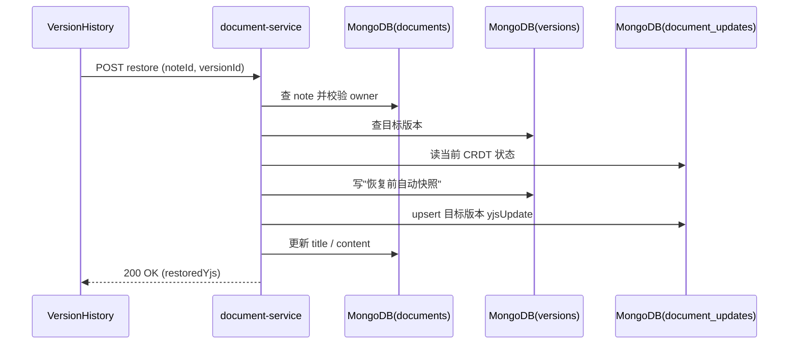
```mermaid
sequenceDiagram
    participant VH as VersionHistory
    participant DS as document-service
    participant Doc as MongoDB(documents)
    participant Ver as MongoDB(versions)
    participant Upd as MongoDB(document_updates)

    VH->>DS: POST restore (noteId, versionId)
    DS->>Doc: 查 note 并校验 owner
    DS->>Ver: 查目标版本
    DS->>Upd: 读当前 CRDT 状态
    DS->>Ver: 写"恢复前自动快照"
    DS->>Upd: upsert 目标版本 yjsUpdate
    DS->>Doc: 更新 title / content
    DS-->>VH: 200 OK (restoredYjs)
```

<p align="center">图 3-16 "版本快照与回滚"用例的顺序图</p>

### 3.3.8 "管理员审计"用例实现的设计方案

"管理员审计"用例的实现途径如下：所有服务在关键操作（登录、注册、文档删除、分享、PDF 解析、版本回滚等）时统一向 `user-service` 写入审计记录（MySQL `audit_logs` 表），管理员通过 `AdminPage` 调用 `user-service` 的 `/admin/audit-logs` 接口查询。具体见图 3-17。

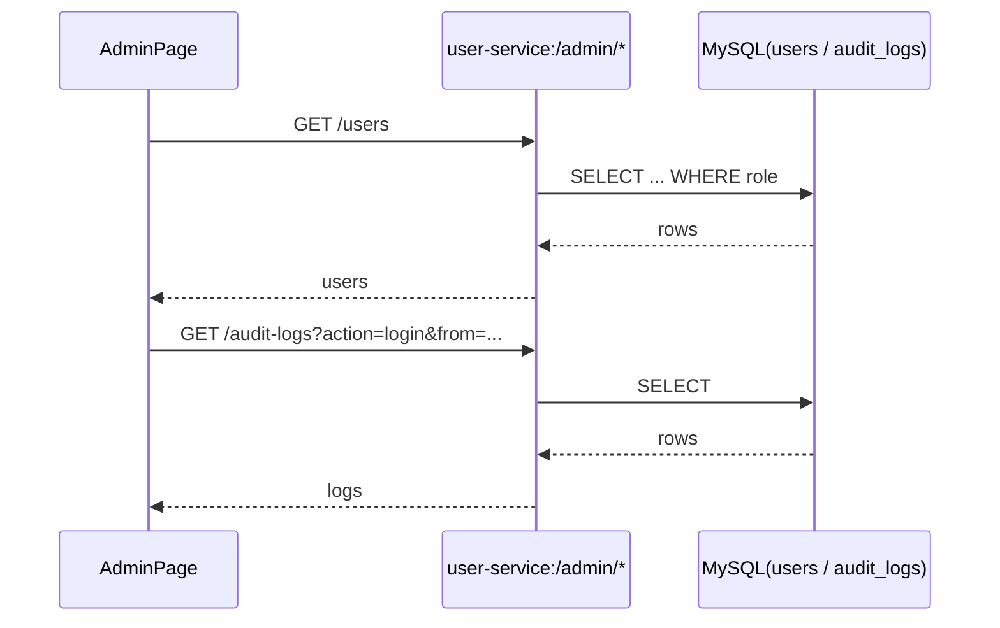
```mermaid
sequenceDiagram
    participant AP as AdminPage
    participant US as user-service:/admin/*
    participant DB as MySQL(users / audit_logs)

    AP->>US: GET /users
    US->>DB: SELECT ... WHERE role
    DB-->>US: rows
    US-->>AP: users
    AP->>US: GET /audit-logs?action=login&from=...
    US->>DB: SELECT
    DB-->>US: rows
    US-->>AP: logs
```

<p align="center">图 3-17 "管理员审计"用例的顺序图</p>

## 3.4 类设计

### 3.4.1 精化用户类间的关系

在分析类图中有一组分析类：`User`、`Admin`、`Owner`、`Collaborator`、`UserRepository`。在软件设计阶段，这些类仍然有意义，将成为软件设计模型中的关键设计类。针对这些设计类间关系的精化设计描述如下，具体见图 3-18。

`UserRepository` 类负责保存 `User` 类的信息。在具体实现时，`UserRepository` 通过提供一组服务将 `User` 类的信息保存到后台的 MySQL 数据库之中，因而 `UserRepository` 类与 `User` 类之间的语义关系表现为一般的关联关系。`Admin` 是特殊的 `User`（通过 `role` 字段区分），`Owner` 与 `Collaborator` 不是 `User` 的子类，而是 `User` 在特定文档上下文中的角色。

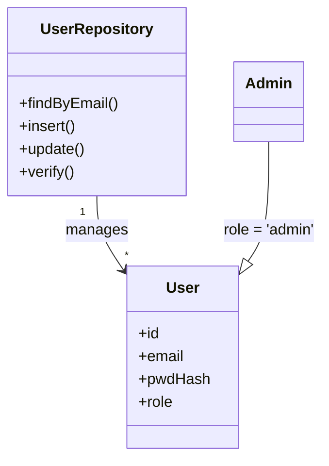
```mermaid
classDiagram
    class UserRepository {
        +findByEmail()
        +insert()
        +update()
        +verify()
    }
    class User {
        +id
        +email
        +pwdHash
        +role
    }
    class Admin
    UserRepository "1" --> "*" User : manages
    Admin --|> User : role = 'admin'
```

<p align="center">图 3-18 精化用户类间以及它们与 UserRepository 类间的关系</p>

### 3.4.2 精化用户界面类间的关系

根据 §3.2 节的用户界面设计，Web 客户端包含一组基于路由的页面类，包括 `LoginPage`、`RegisterPage`、`OAuthCallbackPage`、`EditorPage`、`AdminPage`；以及一组组件类 `Sidebar`、`NoteList`、`Editor`、`ShareDialog`、`VersionHistory`、`SettingsDialog`、`ThemeToggle`、`MainLayout`。这些界面类间的跳转与组合关系如图 3-19 所示。

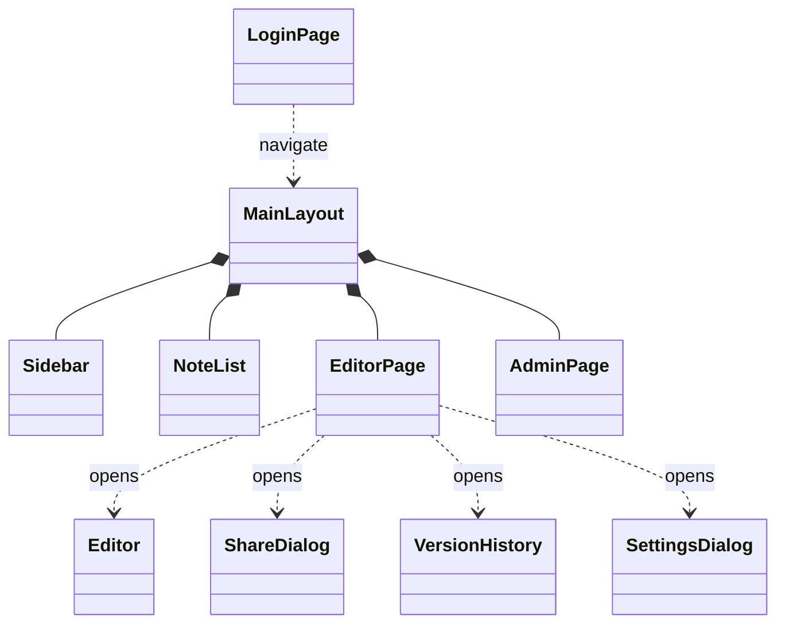
```mermaid
classDiagram
    LoginPage ..> MainLayout : navigate
    MainLayout *-- Sidebar
    MainLayout *-- NoteList
    MainLayout *-- EditorPage
    MainLayout *-- AdminPage
    EditorPage ..> Editor : opens
    EditorPage ..> ShareDialog : opens
    EditorPage ..> VersionHistory : opens
    EditorPage ..> SettingsDialog : opens
```

<p align="center">图 3-19 精化用户界面类间的关系</p>

### 3.4.3 精化关键设计类间的关系

根据 §3.3 节的用例设计，"协作服务"子系统包含若干关键设计类以实现"实时协作编辑"用例，包括实体类 `DocumentSession`、控制类 `CollabServer`、与 MongoDB 持久化代理 `UpdateRepository`。根据 §3.3 所描述的顺序图中类间的交互，`CollabServer` 类与 `DocumentSession` 之间具有组合关系，`DocumentSession` 类与 `UpdateRepository` 之间是依赖关系。这些类的关系精化如图 3-20 所示。

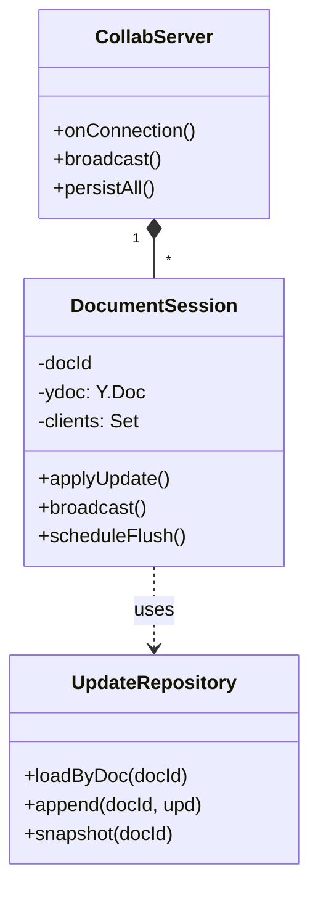
```mermaid
classDiagram
    class CollabServer {
        +onConnection()
        +broadcast()
        +persistAll()
    }
    class DocumentSession {
        -docId
        -ydoc: Y.Doc
        -clients: Set
        +applyUpdate()
        +broadcast()
        +scheduleFlush()
    }
    class UpdateRepository {
        +loadByDoc(docId)
        +append(docId, upd)
        +snapshot(docId)
    }
    CollabServer "1" *-- "*" DocumentSession
    DocumentSession ..> UpdateRepository : uses
```

<p align="center">图 3-20 精化"collab-service"子系统中类间的关系</p>

### 3.4.4 精化 User 类属性的设计

`User` 类属性的精化设计描述如下：

1. **基本属性：** 用户 ID `id`（UUID，String）、邮箱 `email`（String）、显示名 `displayName`（String）、密码哈希 `passwordHash`（String，可空，OAuth 用户可为空）、角色 `role`（枚举：`user` / `admin`）、OAuth 供应商 `oauthProvider`、OAuth 主体 `oauthSubject`。
2. **安全相关属性：** 失败登录次数 `failedLoginAttempts`（Number）、锁定截止时间 `lockedUntil`（Timestamp，可空）。
3. **审计属性：** 创建时间 `createdAt`、更新时间 `updatedAt`。
4. 用户密码哈希属于私有信息，对外部其他类不可见，可见范围为 `private`；通过领域服务进行比对时也只在服务内部使用，不向 API 调用方返回。
5. `passwordHash` 的初始值为 `null`（OAuth 用户）或 bcrypt 哈希；`role` 的初始值为 `user`；`failedLoginAttempts` 的初始值为 `0`。

### 3.4.5 精化 DocumentSession 类属性的设计

`DocumentSession` 是"协作服务"子系统中承载单篇文档实时协作状态的核心实体类（见图 3-20），其在内存中维护一篇文档的权威 CRDT 状态、所有在线连接以及落盘调度。该类属性的精化设计描述如下：

1. **标识属性：** 文档 ID `docId`（String），用于将 WebSocket 连接路由到对应会话。
2. **CRDT 状态属性：** 权威文档 `ydoc`（`Y.Doc`），所有客户端的 update 在此合并，是协作期间的权威数据源（与 `Document.content` 构成§3.4.6 所述"双内容模型"）。
3. **连接管理属性：** 客户端连接集合 `clients`（`Set<WebSocket>`），以及在线状态 `awarenessStates`（光标/选区等 awareness 信息），用于广播与在线人数统计。
4. **落盘调度属性：** 脏标记 `dirty`（Boolean，标识自上次落盘后是否有新 update）、定时器句柄 `flushTimer`（每 5 分钟触发一次快照）、上次快照时间 `lastSnapshotAt`（Timestamp）。
5. 上述属性中，`ydoc`、`clients`、`awarenessStates`、`dirty` 等内部状态可见范围均为 `private`，仅通过 `applyUpdate()`、`broadcast()`、`flush()` 等方法（见§3.4.8）对外暴露行为；`clients` 初始为空集，`dirty` 初始为 `false`。当最后一名客户端从 `clients` 中移除时立即触发 `flush()` 落盘。

### 3.4.6 精化 Document 类属性的设计

`Document` 是"文档服务（document-service）"子系统中的核心实体类。根据子系统中用例实现的交互图，`Document` 类至少有以下基本属性：

```ts
private id: string                  // 文档 ID（MongoDB ObjectId 的十六进制串）
private title: string               // 文档标题
private content: string             // HTML 渲染内容（用于离线/非协同访问）
private ownerId: string             // 文档所有者
private sourcePdfId?: string        // 来源 PDF 的 ID（仅由 PDF 解析生成的笔记拥有）
private createdAt: Date
private updatedAt: Date
```

注：与 `Document` 配对的还有一个 `DocumentUpdate` 实体（存储 Yjs 二进制 update），它是协作编辑期间的权威数据源；`Document.content` 仅在版本快照、离线导出时被刷新，因此二者构成"双内容模型"。当前实现中笔记删除为**物理删除**（`deleteOne`），尚未实现软删除/回收站；工作区归属（`workspaceId`）与标签（`tags`）为后续规划，暂未落到 `documents` 集合的文档结构中。

### 3.4.7 精化持久化层 Repository 类的方法设计

各微服务均采用"路由 → 控制 → 仓储（Repository）"的分层结构，由仓储层封装对数据库的全部读写，向上提供面向领域对象的方法。本节精化跨子系统复用的几个关键仓储类，其方法在 §3.5.2 数据操作设计中进一步落到具体接口签名。图 3-21 给出这些仓储类的方法概览。

`UserRepository`（user-service，对应 MySQL `users` 表）的 `public` 方法包括：`insertUser(user)`、`deleteUser(id)`、`updateUser(user)`、`findByEmail(email)`、`findByOAuth(provider, subject)`、`incrementFailedAttempts(id)`（支撑账户锁定策略）、`verifyUserValidity(email, password)`，以及用于管理连接的 `openConnection()` / `closeConnection()`。

文档侧的仓储类按集合职责拆分（document-service，对应 MongoDB 各集合）：

- `DocumentRepository`（`documents`）：`insertDocument(doc)`、`updateDocument(doc)`、`findById(id)`、`listByOwner(ownerId, filter)`、`deleteDocument(id)`；
- `UpdateRepository`（`document_updates`，承载 Yjs 二进制 update，是协作的权威数据源）：`loadByDoc(docId)`、`append(docId, update)`、`compact(docId)`；
- `VersionRepository`（`versions`）：`snapshot(docId, html, authorId)`、`list(docId)`、`get(versionId)`、`pruneOldVersions(docId, keep=50)`。

这样划分使"用户/鉴权数据"与"文档/协作/版本数据"各自内聚于独立仓储与独立数据库，符合 §2.1 的服务自治原则。

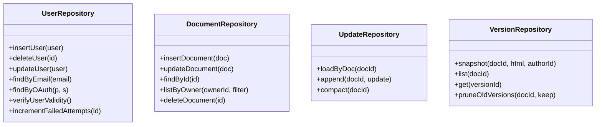
```mermaid
classDiagram
    class UserRepository {
        +insertUser(user)
        +deleteUser(id)
        +updateUser(user)
        +findByEmail(email)
        +findByOAuth(p, s)
        +verifyUserValidity()
        +incrementFailedAttempts(id)
    }
    class DocumentRepository {
        +insertDocument(doc)
        +updateDocument(doc)
        +findById(id)
        +listByOwner(ownerId, filter)
        +deleteDocument(id)
    }
    class UpdateRepository {
        +loadByDoc(docId)
        +append(docId, update)
        +compact(docId)
    }
    class VersionRepository {
        +snapshot(docId, html, authorId)
        +list(docId)
        +get(versionId)
        +pruneOldVersions(docId, keep)
    }
```

<p align="center">图 3-21 精化持久化层 UserRepository、DocumentRepository、UpdateRepository、VersionRepository 等类的方法</p>

### 3.4.8 精化"协作服务"子系统中部分类方法的设计

在图 3-20 所示“协作服务”子系统设计类图的基础上，根据该子系统的用例实现交互图，对 `DocumentSession` 与 `CollabServer` 两个类的方法进行精化设计：

```ts
public applyUpdate(clientId: string, update: Uint8Array): void
public broadcast(from: string, message: Uint8Array): void
public scheduleFlush(intervalMs: number): void
public flush(): Promise<void>
public addClient(ws: WebSocket): void
public removeClient(ws: WebSocket): void
public takeSnapshot(): Promise<VersionId>
```

`CollabServer` 类的方法 `onConnection()` 精化如下：

```ts
public onConnection(ws: WebSocket, req: IncomingMessage): void
```

它从请求 URL 中解析出 `documentId`，校验 JWT，决定是否复用已存在的 `DocumentSession`，并向其注册新的客户端连接。

### 3.4.9 精化 `AuthService` 类中 `login()` 方法的实现算法设计

图 3-22 用 UML 活动图描述了 `AuthService` 类中 `login()` 方法的精化设计：

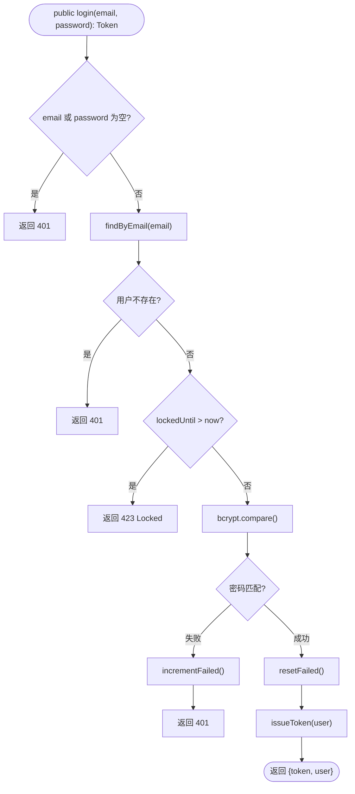
```mermaid
flowchart TB
    Start(["public login(email, password): Token"])
    CheckEmpty{email 或 password 为空?}
    Return401a["返回 401"]
    Find["findByEmail(email)"]
    CheckExists{用户不存在?}
    Return401b["返回 401"]
    CheckLocked{lockedUntil > now?}
    ReturnLocked["返回 423 Locked"]
    Compare["bcrypt.compare()"]
    CheckMatch{密码匹配?}
    IncFailed["incrementFailed()"]
    Return401c["返回 401"]
    ResetFailed["resetFailed()"]
    Issue["issueToken(user)"]
    ReturnOK(["返回 {token, user}"])

    Start --> CheckEmpty
    CheckEmpty -->|是| Return401a
    CheckEmpty -->|否| Find
    Find --> CheckExists
    CheckExists -->|是| Return401b
    CheckExists -->|否| CheckLocked
    CheckLocked -->|是| ReturnLocked
    CheckLocked -->|否| Compare
    Compare --> CheckMatch
    CheckMatch -->|失败| IncFailed --> Return401c
    CheckMatch -->|成功| ResetFailed --> Issue --> ReturnOK
```

<p align="center">图 3-22 精化 AuthService 类中 login() 方法的详细设计</p>

### 3.4.10 精化 `RAGEngine` 类中 `answer()` 方法的实现算法设计

图 3-23 用 UML 活动图描述了 `RAGEngine` 类中 `answer()` 方法的详细设计。它定义了该方法的接口 `def answer(self, query, doc_id) -> Iterable[str]`，描述了其内部的实现算法：首先在 Chroma 中对 `query` 做向量相似度检索，取 top-k chunk；然后构造 prompt（包含上下文与原始问题）；接着通过 `ModelGateway.stream_model()` 调用具体的 LLM 供应商；最后将模型生成的 chunk 通过 SSE 流式返回。整个过程中需要处理三种异常：检索结果为空（回退为无上下文回答）、模型调用超时（返回兜底文本）、`mock` 供应商分支（直接返回预制回答）。

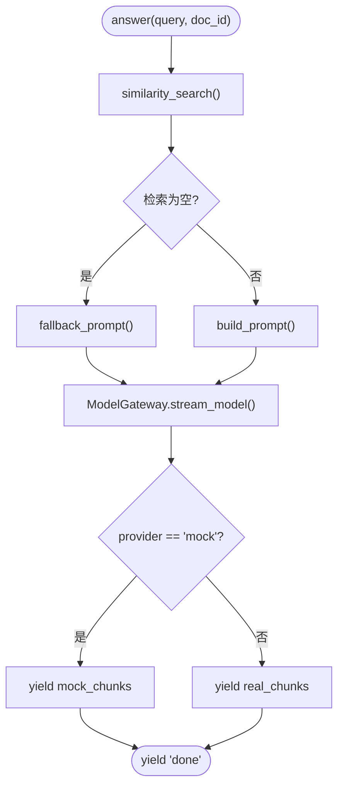
```mermaid
flowchart TB
    Start(["answer(query, doc_id)"])
    Search["similarity_search()"]
    CheckEmpty{检索为空?}
    Fallback["fallback_prompt()"]
    Build["build_prompt()"]
    Stream["ModelGateway.stream_model()"]
    CheckMock{provider == 'mock'?}
    YieldMock["yield mock_chunks"]
    YieldReal["yield real_chunks"]
    Done(["yield 'done'"])

    Start --> Search
    Search --> CheckEmpty
    CheckEmpty -->|是| Fallback
    CheckEmpty -->|否| Build
    Fallback --> Stream
    Build --> Stream
    Stream --> CheckMock
    CheckMock -->|是| YieldMock --> Done
    CheckMock -->|否| YieldReal --> Done
```

<p align="center">图 3-23 精化 RAGEngine 类中 answer() 方法的详细设计</p>

### 3.4.11 构造类的状态图和活动图

如果一个类的对象具有较为复杂的状态，在其生命周期中需要针对外部和内部事件实施一系列的活动以变迁其状态，那么可以考虑构造和绘制类的状态图。

`PDFJob` 类对象具有较为复杂的状态：创建时处于 `queued` 状态，被后台任务取出后变为 `parsing`（该阶段内完成 PDF 解析、图片落盘、写入文档与构建 Chroma 索引），全部成功后进入 `parsed`；任一环节失败则进入 `failed`，并允许用户调用 `/pdf/jobs/:id/retry` 接口重新回到 `queued`。图 3-24 描述了 `PDFJob` 类对象的状态图（状态名与代码 `pdf_parse_jobs.status` 字段一致）：

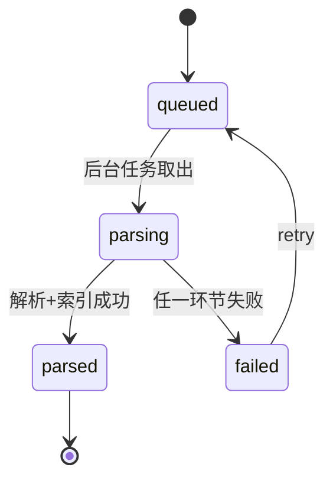
```mermaid
stateDiagram-v2
    [*] --> queued
    queued --> parsing : 后台任务取出
    parsing --> parsed : 解析+索引成功
    parsing --> failed : 任一环节失败
    failed --> queued : retry
    parsed --> [*]
```

<p align="center">图 3-24 PDFJob 类对象的状态图</p>

如果某个类在实现其职责过程中需要执行一系列的方法、与其他对象进行诸多的交互，那么可以考虑构造和绘制针对该类某些职责的活动图。本系统的核心亮点之一是"离线优先"——离线编辑与联网后的冲突同步横跨前端 `NotesContext`、本地 `offlineDb` 与 `sync-service` 三方协作。图 3-25 用 UML 的活动图及泳道机制描述了三者如何协作完成"离线编辑—上线同步—冲突处理"这一职责。

```mermaid
flowchart TB
    subgraph NC["NotesContext (前端逻辑)"]
        A1[离线编辑笔记]
        A2[监听 online 事件]
        A3[读取待同步队列]
        A4[POST /push: changes + baseUpdatedAt]
        A5{存在冲突?}
        A6[提示用户: 覆盖/放弃/合并]
        A7[标记已同步, 清空队列项]
    end
    subgraph ODB["offlineDb (IndexedDB)"]
        B1[putNote 写本地]
        B2[enqueue 入 sync_queue]
        B3[getQueue 返回队列项]
    end
    subgraph SS["sync-service"]
        C1[按 baseUpdatedAt 检测冲突]
        C2[合并写入 MongoDB]
        C3[返回 applied + conflicts]
    end

    A1 --> B1 --> B2
    A2 --> A3 --> B3 --> A4 --> C1
    C1 --> C2 --> C3 --> A5
    A5 -->|是| A6
    A5 -->|否| A7
```

<p align="center">图 3-25 NotesContext、offlineDb、sync-service 协作完成离线编辑与同步的活动图</p>

## 3.5 数据设计

### 3.5.1 设计永久保存数据的数据库表及字段

针对"AI 增强协作笔记系统"中的关键实体，分别为其设计在 MySQL 与 MongoDB 中持久化保存的数据库表/集合。

**① MySQL 数据库表**

针对系统中的 `User` 类，为其设计持久保存的数据库表 `users`。该表的字段如下，具体见表 3-1：

| 字段 | 类型 | 说明 |
|------|------|------|
| id | VARCHAR(36) PRIMARY KEY | 用户 ID（UUID） |
| email | VARCHAR(255) UNIQUE | 用户邮箱 |
| display_name | VARCHAR(120) | 用户昵称 |
| password_hash | VARCHAR(255) NULL | 密码哈希（OAuth 用户可空） |
| role | ENUM('user','admin') | 用户角色 |
| oauth_provider | VARCHAR(40) NULL | 第三方登录供应商 |
| oauth_subject | VARCHAR(255) NULL | 第三方登录主体 |
| failed_login_attempts | INT | 累计失败登录次数 |
| locked_until | TIMESTAMP NULL | 账户锁定截止时间 |
| created_at | TIMESTAMP | 创建时间 |
| updated_at | TIMESTAMP | 更新时间 |

<p align="center">表 3-1 保存 User 类对象的数据库表 users</p>

针对系统中的"分享"实体，设计数据库表 `shares`，字段包括 `id`、`document_id`、`sharer_id`、`sharee_id`、`permission` (`read`/`write`)、`created_at`；并通过 `(document_id, sharee_id)` 建立唯一键以防止重复分享。

针对系统中的"工作区"实体，设计数据库表 `workspaces`，字段包括 `id`、`name`、`owner_id`、`created_at`。

针对系统中的"审计日志"实体，设计数据库表 `audit_logs`，字段包括 `id`、`user_id`、`action`、`target_id`、`metadata` (JSON)、`created_at`，并按 `(user_id, created_at)` 与 `(action, created_at)` 建立组合索引。

**② MongoDB 集合**

针对系统中的笔记内容、版本、CRDT 二进制 update、协作事件、PDF 资源、审计日志等非结构化或半结构化数据，使用 MongoDB 数据库 `notes` 中的以下集合：

| 集合 | 用途 | 关键索引 |
|------|------|----------|
| documents | 笔记主表（HTML 内容、元数据） | `{ownerId:1, updatedAt:-1}`, `{title:'text'}` |
| versions | 版本快照 | `{documentId:1, createdAt:-1}` |
| document_updates | Yjs 二进制 update | `{documentId:1}` |
| collaboration_events | 协作事件流 | `{documentId:1, createdAt:-1}` |
| pdf_assets | PDF 原文件与图片资源元数据 | `{ownerId:1, createdAt:-1}`, `{noteId:1}` |
| audit_logs | 镜像存放需要全文检索的审计日志 | `{userId:1,createdAt:-1}`, `{action:1,createdAt:-1}` |

**③ 对象存储 MinIO**

针对系统中“PDF 原文件”与“解析图片”的非结构化二进制数据，统一使用单个 MinIO 桶（默认 `notes-assets`，可通过环境变量 `MINIO_BUCKET` 配置；桶不存在时由 document-service 自动创建）。解析出的图片对象 key 规则为 `{userId}/pdf-assets/{pdfId}/{path}`，PDF 原文件存放在同一桶的按用户隔离前缀下。

**④ 向量库 Chroma**

针对系统中的笔记 chunk embedding，使用 Chroma 持久化集合 `note_chunks`，每条记录包含 `noteId`、`chunkIndex`、`text`、`embedding`、`metadata`。

### 3.5.2 设计永久数据的操作

为了支持对 `users` 数据库表的操作，设计模型中有一个关键设计类 `UserRepository`，它提供了一组方法以实现将 `User` 类对象的数据插入到 `users` 表中、或者从中删除、或者修改表中的数据、或者从数据库表中查询相关用户的信息等等，具体的接口描述如下：

```ts
- Promise<User>          insertUser(user: User)
- Promise<boolean>       deleteUser(id: string)
- Promise<boolean>       updateUser(user: User)
- Promise<User | null>   findByEmail(email: string)
- Promise<User | null>   findByOAuth(provider: string, subject: string)
- Promise<boolean>       verifyUserValidity(email: string, password: string)
- Promise<void>          incrementFailedAttempts(id: string)
- Promise<void>          resetFailedAttempts(id: string)
- Promise<void>          openConnection()
- Promise<void>          closeConnection()
```

类似地，针对 MongoDB `documents` 集合，设计 `DocumentRepository` 类，提供 `insertDocument(doc)`、`updateDocument(doc)`、`findById(id)`、`listByOwner(ownerId, filter)`、`deleteDocument(id)` 等方法（当前实现为物理删除）。

针对 `document_updates` 集合，设计 `UpdateRepository` 类，提供 `loadByDoc(docId): Uint8Array[]`、`append(docId, update)`、`compact(docId)` 等方法。

针对 `versions` 集合，设计 `VersionRepository` 类，提供 `snapshot(docId, html, authorId)`、`list(docId)`、`get(versionId)`、`pruneOldVersions(docId, keep=50)` 等方法。

## 3.6 部署设计

"AI 增强协作笔记系统"采用基于 Docker Compose 的容器化分布式部署方式（见图 3-26）。其中：

- 客户端层包括运行在浏览器中的 Web SPA、安装在桌面的 Electron 应用，以及具有 PWA 离线能力的移动端浏览器。
- 网关层：`nginx` 容器作为统一入口，监听宿主机的 80 端口；
- 业务服务层：`user-service`、`document-service`、`collab-service`、`sync-service` 四个 Node.js 容器，以及 `ai-service` Python 容器；
- 数据层：`mysql` 容器保存用户与共享信息；`mongodb` 容器保存笔记、版本与 Yjs update；`redis` 容器为协作服务后续多实例扩展预留（用于跨实例广播 awareness，当前单实例实现尚未接入）；`minio` 容器保存 PDF 与图片；Chroma 以本地文件形式挂载在 `ai-service` 容器内；
- AI 服务的 PDF 解析强制走 MinerU：默认调用 `ai-service` 镜像内的 `mineru` 命令，或通过 `MINERU_API_URL` 调用独立的 MinerU API 容器（推荐通过 `docker compose -f docker-compose.mineru.yml up` 启用，需要 NVIDIA GPU）。

各容器之间通过 Docker 内置网络互联，仅 `nginx` 暴露端口到宿主机。所有服务通过共享的 `JWT_SECRET` 实现跨服务身份认证，通过 `INTERNAL_SERVICE_SECRET` 请求头实现内部 API 鉴权。

```mermaid
graph TB
    Internet((Internet))
    Client["客户端<br/>(浏览器 / PWA / Electron)"]

    subgraph Host["宿主机 / 云服务器"]
        subgraph Docker["Docker Bridge Network"]
            Nginx["nginx<br/>(gateway)"]
            Web["web :5173"]
            User["user-service :3001"]
            Doc["document-service :3002"]
            Collab["collab-service :3004"]
            Sync["sync-service :3005"]
            AI["ai-service :3003<br/>(可选 GPU - MinerU)"]

            MySQL[("mysql :3306")]
            Mongo[("mongodb :27017")]
            Redis[("redis :6379")]
            MinIO[("minio :9000")]
            Chroma[("chroma (volume)")]
        end
    end

    Client --> Internet
    Internet -->|80| Nginx
    Nginx --> Web
    Nginx --> User
    Nginx --> Doc
    Nginx --> Collab
    Nginx --> Sync
    Nginx --> AI

    User --> MySQL
    Doc --> Mongo
    Doc --> MinIO
    Collab --> Mongo
    Collab -. 预留扩展 .-> Redis
    Sync --> Mongo
    AI --> Chroma
```

<p align="center">图 3-26 “AI 增强协作笔记系统”的部署图</p>

